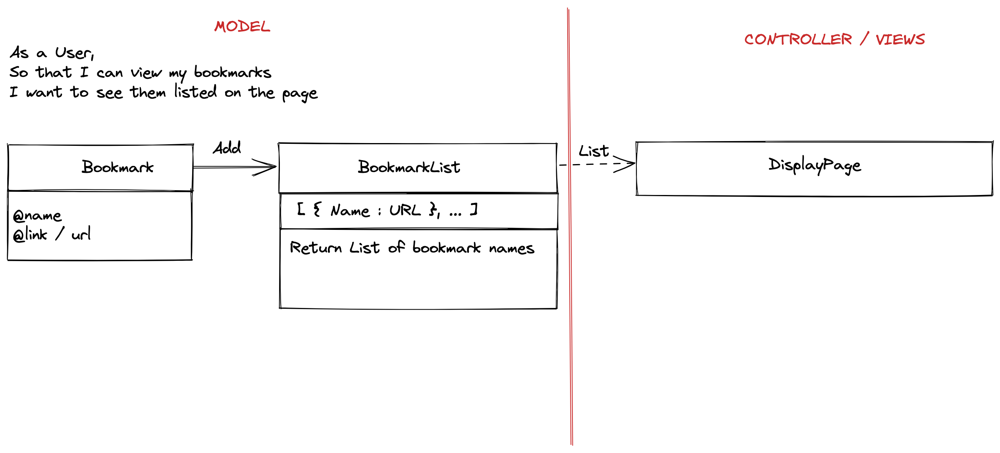

> As a user,
> So that I can view my bookmarks,
> I want to see them listed on the page.

## Database Setup Instructions:
1. Connect to psql
2. Create the database using the psql command CREATE DATABASE bookmark_manager;
3. Connect to the database using the pqsl command \c bookmark_manager;
4. To set up the appropriate tables, connect to the database in `psql` and run the SQL scripts in the `db/migrations` folder in the given order.
5. Run the query we have saved in the file 01_create_bookmarks_table.sql